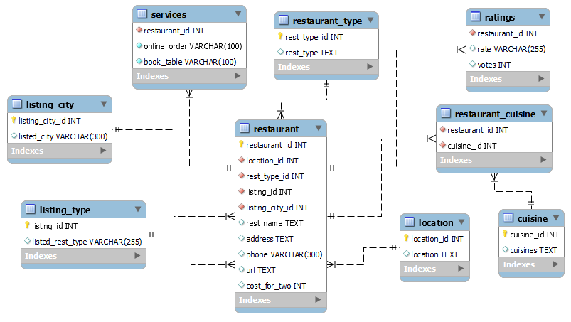
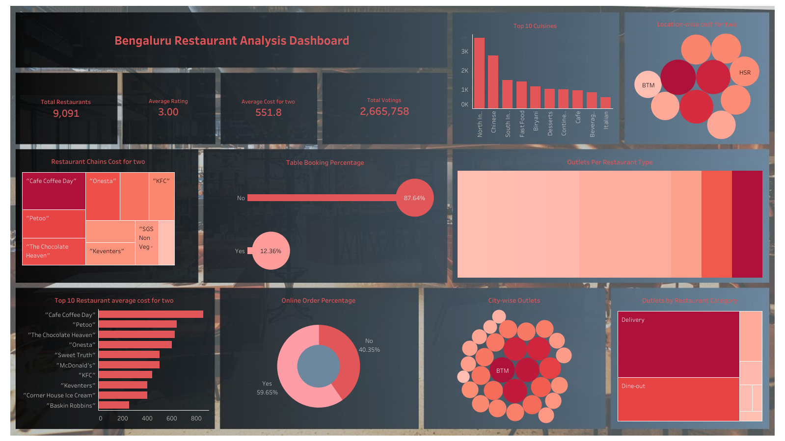

# Bengaluru Restaurant Trend Analysis


## 📖 Project Overview
Bengaluru, one of India's largest metropolitan cities, has a thriving food industry with over **12,000 restaurants**. However, high operational costs and intense competition make it difficult for new restaurants to succeed.
This project aims to analyze restaurant trends, customer preferences, and pricing patterns using the **Bengaluru restaurant database** to help new businesses make data-driven decisions on best locations for restaurants, most popular cuisines, optimal pricing strategies, and Restaurant types with high success rates.

## 🌐Data Sources

- <b>restaurant:</b> This table captures the demographic attributes of the restaurants along with their estimated cost for two diners. <br>
- <b>restaurant_type:</b> This table contains detailed information about the types of services offered by each restaurant. <br>
- <b>ratings:</b> This table captures data on restaurant ratings along with customer footfall. <br>
- <b>services:</b> This table indicates the availability of online ordering and table reservation options for each restaurant. <br>
- <b>location:</b> This table provides details on the geographical locations of the restaurants. <br>
- <b>cuisine:</b> This table details the variety of cuisines provided by the restaurants. <br>
- <b>restaurant_cuisine:</b> This table establishes the relationship between restaurants and the cuisines they offer. <br>
- <b>listing_city:</b> This table provides information on the cities where the restaurants are located. <br>
- <b>listing_type:</b> This table provides information about the categories of restaurants (e.g., café, fine dining, quick service). <br>

### 💻Tools

- Sql - Creating database, tables, data retrieval, and data querying
- Python - Data cleaning and normalization, Exploratory Data analysis
- Sqlalchemy - Loading SQL data into python
- Pandas - Data manipulation
- Matplotlib & Seaborn - Data visualization
- Scipy - Statistical analysis
- Tableau - Creating interactive dashboard and reports

### 🔍Data Cleaning and Preparation

Before importing the tables into the MySQL server, I cleaned and normalized the data using Python by converting data types, handling null values, and restructuring the data into separate, normalized tables. This ensured smooth and efficient integration into the SQL database.

  <a href="https://github.com/Bhuvi128/Hospitality-Revenue-Optimization-Analysis/blob/main/Hospitality%20Revenue%20Optimzation.ipynb" target="_blank" style="text-decoration:none;">
    
  </a>
</p>

### 💾Database & tables creation

After preparing and cleaning the data in Python—by handling null values, converting data types, and normalizing the structure—I created the database and its corresponding tables in MySQL. The cleaned and organized data was then imported into these tables. The database schema is illustrated in the image below.<br>



### 🧾SQL Queries

Executed SQL queries on the restaurant_blr database to extract relevant data from multiple tables and performed meaningful joins. Cleaned the data and carried out initial aggregations, including total restaurants, total votes, average ratings per restaurant chain, as well as city-wise and location-wise outlet counts and cuisine distribution. This preprocessing reduced the computational load in Python by delivering a structured dataset optimized for efficient exploratory data analysis.<br>

1. Distribution of restaurant outlets by restaurant category (listed_rest_type)

```sql
select li.listed_rest_type, count(distinct re.restaurant_id) total_outlets
from restaurant re left join listing_type li
on re.listing_id = li.listing_id
group by li.listed_rest_type
order by total_outlets desc;
```

2. Distribution of restaurant outlets by cuisines

```sql
select cu.cuisines, count(distinct re.restaurant_id) total_outlets
from restaurant re left join restaurant_cuisine rc
on re.restaurant_id = rc.restaurant_id
left join cuisine cu
on rc.cuisine_id = cu.cuisine_id
group by cu.cuisines
order by total_outlets desc;
```

2. Top 3 restaurants per locality based on votes

```sql
with ranked_restaurants as (
	select 
	  re.rest_name,
      lo.location,
      ra.votes,
      rank() over(partition by lo.location order by ra.votes desc) as rank_in_location
    from restaurant re left join location lo
	on re.location_id = lo.location_id
	left join ratings ra
	on re.restaurant_id = ra.restaurant_id
)
select * from ranked_restaurants
where rank_in_location>= 3;
```

3. Restaurants in top 10% ratings bracket

```sql
with percentile_rating as(
	select
      re.rest_name,
      ra.rate,
      percent_rank() over(order by ra.rate desc) as percentile_rank
	from ratings ra right join restaurant re 
    on ra.restaurant_id = re.restaurant_id
)
select * from percentile_rating;
```

4. Average cost for two and rating by locality

```sql
select lo.location, count(distinct re.restaurant_id) total_outlets,
round(avg(re.cost_for_two),2) avg_cost_for_two,
round(avg(ra.rate),2) avg_ratings
from restaurant re left join location lo
on re.location_id = lo.location_id
left join ratings ra
on re.restaurant_id = ra.restaurant_id
group by lo.location
order by lo.location;
```

5. Table booking distribution

```sql
select book_table, count(*) booking_count
from services
group by book_table;
```

6. Distribution of restaurant outlets by online order status

```sql
select sv.online_order, count(distinct re.restaurant_id) total_outlets
from services sv right join restaurant re
on sv.restaurant_id = re.restaurant_id
group by sv.online_order
order by total_outlets desc;
```
<p>
  <a href="https://github.com/Bhuvi128/Hospitality-Revenue-Optimization-Analysis/blob/main/Hospitality%20Revenue%20Analysis.sql" target="_blank" style="text-decoration:none;">
    
  </a>
</p>

### ✨🔍Exploratory Data Analysis (EDA)

Conducted in-depth exploratory data analysis to uncover restaurant trends, customer preferences, and rating patterns. The analysis focused on various factors, including:<br>

- <b>Distribution Analysis of:</b>
  - Restaurant chains, location, city, services, restaurant type, restaurant category, cost for two, ratings, votings, and cuisines
  - Restaurant chains by cuisines, services, city, location, restaurant type, restaurant category, average cost for two, average ratings, and total votings


- <b>Relationship Analysis for numerical data:</b>
  - Analyzed the correlation between ratings and votings
  - Analyzed the correlation between cost for two and ratings
  - Analyzed the correlation between cost for two and votings

- <b>Relationship Analysis for categorical data:</b>
  - Restaurant chains vs restaurant category, restaurant type, city, cuisines, ratings, votings, cost for two, online order, and table booking
  - Ratings with 4 or higher vs restaurant chains, restaurant category, restaurant type, cuisines, cost for two, online order, and table booking
  - Restaurant type vs cuisines, ratings, votings, cost for two, online order, and table booking
  - City-wise analysis of restaurant category, ratings, votings, cost for two, cuisines, table booking

- <b>Hypothesis testing:</b>
  - Performed hypothesis testing to determine whether there is a statistically significant relationship between restaurant ratings and the number of votes received.

<p>
  <a href="https://github.com/Bhuvi128/Hospitality-Revenue-Optimization-Analysis/blob/main/Hospitality%20Revenue%20Optimzation.ipynb" target="_blank" style="text-decoration:none;">
    
  </a>
</p>

### 📊Interactive dashboard

Built an interactive Tableau dashboard to empower stakeholders with real-time insights into restaurant trends and performance metrics.

<br>

<p>
  <a href="https://public.tableau.com/app/profile/bhuvanendiran.s/viz/HospitalityRevenueAnalysisDashboard/HospitalityDashboard" target="_blank" style="text-decoration:none;">
    
  </a>
   <a href="https://github.com/Bhuvi128/Hospitality-Revenue-Optimization-Analysis/tree/main/Tableau%20dashobard" target="_blank" style="text-decoration:none;">
    
  </a>
</p>

### 📝Results/Findings

- <b>Top Restaurant Chains</b>
  - Cafe Coffee Day, McDonald's, and Baskin Robbins dominate the Bengaluru market.
    
- <b>Cuisine Trends</b>
  - North Indian, South Indian, and Chinese cuisines are the most popular.
    
- <b>Location-Based Preferences:</b>
  - Premium restaurants thrive in **Koramangala & Indiranagar**  
  - Budget-friendly options perform well in **BTM Layout & Whitefield** 
 

## 🔥 Key Insights
✔️ **Top Restaurant Chains:** Cafe Coffee Day, McDonald's, and Baskin Robbins dominate the Bengaluru market.  
✔️ **Cuisine Trends:** North Indian, South Indian, and Chinese cuisines are the most popular.  
✔️ **Location-Based Preferences:**
   - Premium restaurants thrive in **Koramangala & Indiranagar**  
   - Budget-friendly options perform well in **BTM Layout & Whitefield**  
✔️ **Pricing vs Ratings:** Moderate-to-premium pricing attracts better ratings and repeat customers.  

## 🚀 Business Recommendations
📍 **Location Strategy:** IT hubs (Koramangala, Indiranagar) for premium restaurants; residential areas (BTM Layout, Whitefield) for budget-friendly restaurants.  
🍽 **Cuisine Selection:** North Indian, South Indian, and Chinese have the highest customer demand.  
💰 **Pricing Strategy:** Moderate pricing attracts better ratings; premium pricing works in high-income areas.  
🏬 **Restaurant Type:** Fine and casual dining receive higher ratings than quick-service restaurants.  

## Technologies Used
- 🐍 Python
- 🗄️ MySQL
- 📜 Pandas, SQLAlchemy
